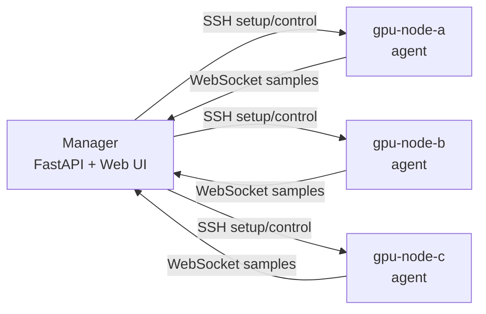
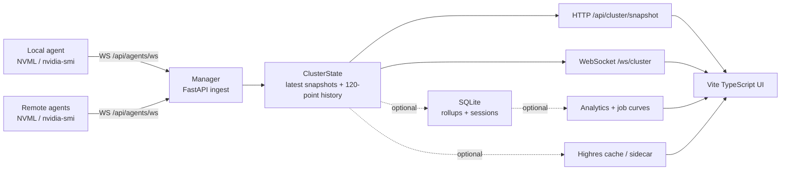

<p align="center">
  
</p>

<h1 align="center">Constella</h1>

<p align="center">
  <strong>Lightweight GPU Cluster Monitoring & Workload History</strong>
</p>

<p align="center">
  Monitor today. Review tomorrow.
</p>

<div align="center" id="constella-badges">

[](https://www.python.org/)
[](https://docs.nvidia.com/deploy/nvml-api/)
[](https://deepwiki.com/kuma-loong/Constella)

</div>

<p align="center">English | <a href="README_zh.md">简体中文</a></p>

<div align="center">
  <blockquote>
    <em>Like stars in a constellation, <strong>Constella</strong> gathers independent GPU nodes into one observable cluster.</em>
  </blockquote>
</div>

Constella is a lightweight GPU monitoring platform for labs, AI teams, and personal GPU servers.

Unlike terminal tools that only show the current state, Constella automatically records GPU workload history, making it easy to review completed training and inference jobs. It supports standalone servers and small GPU clusters without requiring a heavyweight Prometheus/Grafana stack.

## Screenshots

<table>
  <tr>
    <th>Cluster Overview</th>
    <th>GPU & Process Detail</th>
  </tr>
  <tr>
    <td></td>
    <td></td>
  </tr>
</table>

**Workload Curves**

<p align="center">
  
</p>

## Features

**Workload History**

- Automatically record GPU curves for completed workloads.
- Review training and inference jobs from the last 7 days.
- Prefer high-resolution memory cache for recent short jobs, with SQLite rollups for persisted history.

**GPU Monitoring**

- Monitor a standalone server or a small GPU cluster from one Web UI.
- Track GPU utilization, memory, power, temperature, clocks, processes, users, PIDs, and command fingerprints.
- Use NVML first and fall back to `nvidia-smi` when needed.

**Multi-User Analytics**

- See user GPU usage rankings, job duration rankings, node trends, and range-aware heatmaps.
- Detect low-utilization reservations and off-hour activity.
- Keep realtime monitoring available even when historical analytics are disabled.

**Lightweight Deployment**

- No root privileges, system service, Prometheus, or Grafana required.
- One manager process receives data from local and remote GPU agents.
- Remote GPU nodes only need Python, NVIDIA drivers, and SSH access.

## Why Constella?

| Capability | nvitop | Prometheus/Grafana | Constella |
| --- | --- | --- | --- |
| Realtime GPU view | Yes | Yes | Yes |
| Workload history | No | Requires setup | Yes |
| Small cluster view | Limited | Yes | Yes |
| Lightweight setup | Yes | No | Yes |
| Web UI | No | Yes | Yes |
| User/job analytics | No | Custom dashboards | Built in |

Constella sits between terminal monitoring and a full observability stack: more historical and shareable than `nvitop`, but much lighter to deploy than Prometheus/Grafana for a small lab.

## Quick Start

Start the manager and local GPU agent:

```bash
cd Constella
./scripts/service/setup.sh
./scripts/service/start.sh
```

Open:

```text
http://127.0.0.1:8765/overview
```

If the service runs on a remote server, forward the port from your local machine:

```bash
ssh -N -L 8765:127.0.0.1:8765 <user>@<server>
```

Enable SQLite history when workload history and analytics are needed:

```bash
DB_PATH=run/constella.db ./scripts/service/start.sh
```

Start the high-resolution sidecar when short-job curve cache should run outside the manager process:

```bash
DB_PATH=run/constella.db HIGHRES_SIDECAR=1 ./scripts/service/start.sh
```

The sidecar listens on `127.0.0.1:8766` by default and subscribes to the manager stream at `ws://127.0.0.1:8765/api/highres/stream`. Simple deployments can skip the sidecar; the manager still exposes the built-in `/api/highres/*` endpoints.

## Cluster Mode

Prepare the remote node manifest:

```bash
cp docs/nodes.example.yaml nodes.yaml
```

Edit `manager_url`, `manager_hostname`, and the GPU nodes, then configure passwordless SSH from the manager host to each GPU node.



Start remote GPU agents:

```bash
./scripts/cluster/start.sh
```

- `scripts/service/start.sh` creates `run/agent-token` on first local-agent startup, and `scripts/cluster/start.sh` uses that token for remote agents.
- If the manager host should not monitor local GPUs, start with `LOCAL_AGENT=0`.
- Remote nodes do not need `uv`; the manager syncs a minimal agent runtime.

## Architecture



The manager does not sample GPUs directly. Local and remote nodes both report current sample points through the same agent WebSocket path. SQLite, analytics, and high-resolution job curves are optional side paths and do not block realtime snapshots. See [Design](docs/DESIGN.md) for the full data flow.

## Docs

- [Design](docs/DESIGN.md): architecture, data path, low-overhead strategy, and data contracts.
- [Operations](docs/OPERATIONS.md): startup, access, cluster agent management, status, and verification commands.
- [SQLite History](docs/HISTORY.md): persistence, rollups, maintenance, and job curves.
- [Cloudflare Tunnel](docs/CLOUD_TUNNEL.md): domain access without opening an inbound server port.
- [Node manifest example](docs/nodes.example.yaml): `nodes.yaml` template for remote agents.
- [Scripts](scripts/README.md): service, cluster, tunnel, maintenance, and dev script entry points.

## Project Layout

```text
src/constella/          Python backend, agent, cluster manager, NVML sampler, API/WebSocket
frontend/               Vite + TypeScript frontend
scripts/                categorized service, cluster, tunnel, maintenance, and dev scripts
docs/                   design and operations notes
tests/                  unit tests
```

## Development

```bash
uv sync
uv run pytest

cd frontend
npm install
npm run build
```

Frontend dev server:

```bash
cd frontend
npm run dev
```

For production, build `frontend/dist`; FastAPI serves the static frontend directly.

## API

- `GET /api/health`
- `GET /api/cluster/snapshot`
- `GET /api/settings`
- `PATCH /api/settings`
- `WS /ws/cluster`
- `WS /api/agents/ws`
- `GET /api/history/gpu`
- `GET /api/history/tasks`
- `GET /api/users`
- `GET /api/analytics/overview`
- `GET /api/analytics/node/{node_id}`
- `GET /api/highres/status`
- `GET /api/highres/jobs`
- `GET /api/highres/jobs/{job_key}`
- `GET /api/highres/jobs/{job_key}/gpu`
- `GET /api/docs`

When SQLite is not enabled, history, analytics, and job curve search APIs return `enabled:false`; realtime cluster monitoring continues through `/api/cluster/snapshot` and `/ws/cluster`.

## License

[MIT](LICENSE)
