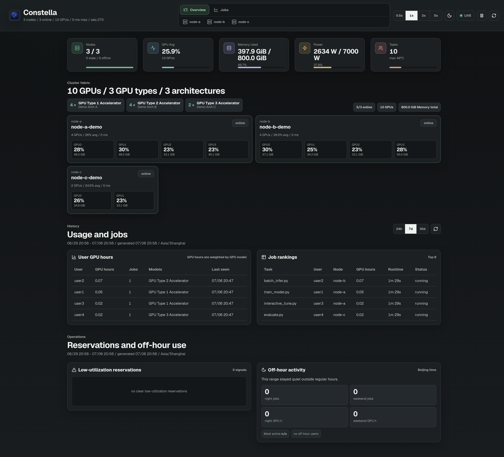
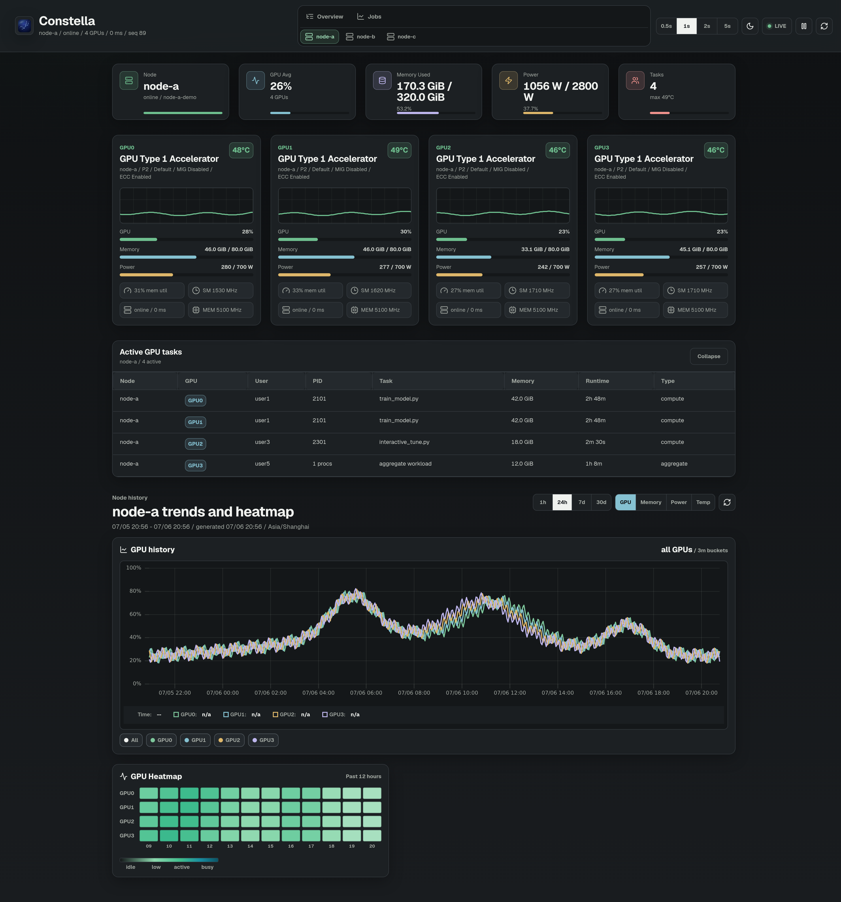
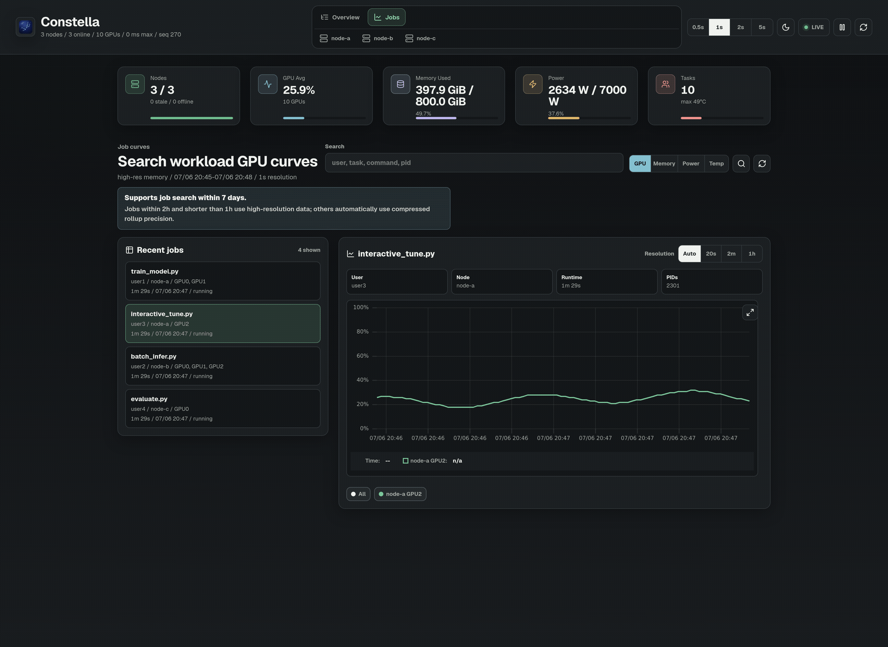
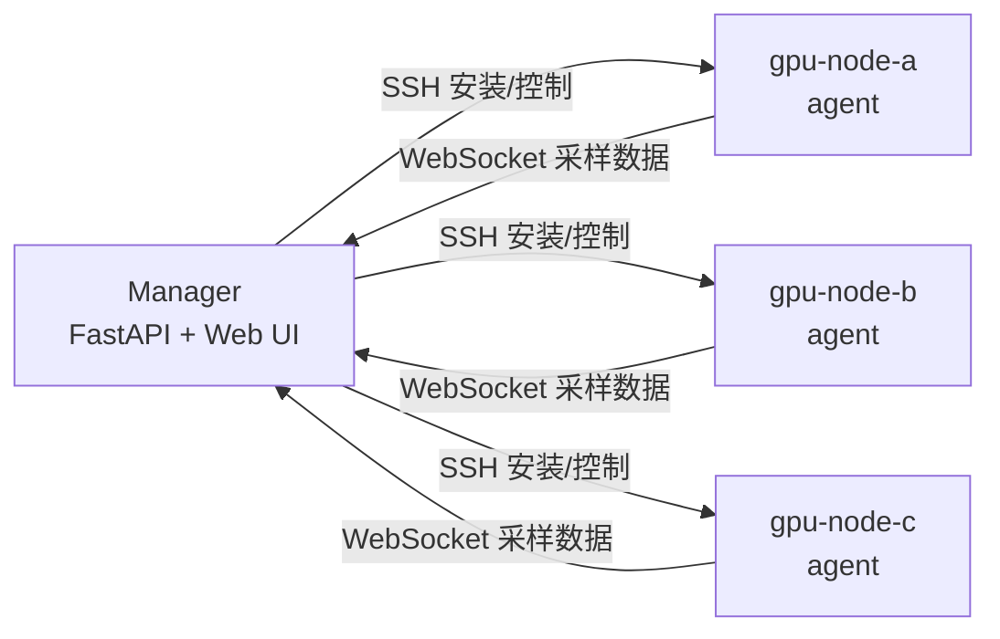
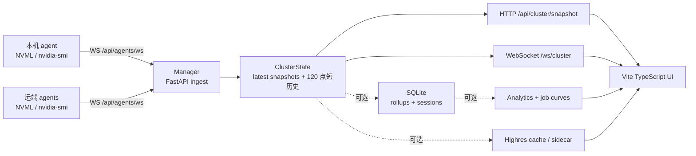

<p align="center">
  
</p>

<h1 align="center">Constella</h1>

<p align="center">
  <strong>轻量级 GPU 集群监控与任务历史追踪</strong>
</p>

<p align="center">
  今天监控，明天复盘。
</p>

<div align="center" id="constella-badges">

[](https://www.python.org/)
[](https://docs.nvidia.com/deploy/nvml-api/)
[](https://deepwiki.com/kuma-loong/Constella)

</div>

<p align="center"><a href="README.md">English</a> | 简体中文</p>

<div align="center">
  <blockquote>
    <em>如同星座中的群星，<strong>Constella</strong> 将独立的 GPU 节点汇聚成一个可观测的集群。</em>
  </blockquote>
</div>

Constella 是一个面向实验室、AI 团队和个人 GPU 服务器的轻量级 GPU 监控平台。

不同于只能查看当前状态的终端工具，Constella 会自动记录 GPU 任务历史，方便在训练或推理结束后回看 GPU 曲线。它支持单机和小型 GPU 集群，不需要先部署一整套 Prometheus/Grafana 监控系统。

## 截图

<table>
  <tr>
    <th>集群总览</th>
    <th>GPU 与进程详情</th>
  </tr>
  <tr>
    <td></td>
    <td></td>
  </tr>
</table>

**任务曲线**

<p align="center">
  
</p>

## 功能

**任务历史追踪**

- 自动记录已完成任务的 GPU 曲线。
- 回看最近 7 天内的训练和推理任务。
- 短任务优先使用高分辨率内存缓存，持久化历史由 SQLite rollup 提供。

**GPU 监控**

- 在一个 Web UI 中监控单机或小型 GPU 集群。
- 查看 GPU 利用率、显存、功耗、温度、时钟、进程、用户、PID 和命令指纹。
- 优先使用 NVML 采样，必要时使用 `nvidia-smi` 兜底。

**多用户分析**

- 查看用户 GPU 使用排行、作业用时排行、节点趋势和按时间窗自适应的热力图。
- 检测低利用率占用和非工作时段活动。
- 即使不启用历史分析，实时监控也可以正常工作。

**轻量部署**

- 不需要 root 权限、system service、Prometheus 或 Grafana。
- 一个 manager 进程接收本机和远端 GPU agent 的数据。
- 远端 GPU 节点只需要 Python、NVIDIA 驱动和 SSH 访问权限。

## 为什么是 Constella？

| 能力 | nvitop | Prometheus/Grafana | Constella |
| --- | --- | --- | --- |
| 实时 GPU 状态 | 支持 | 支持 | 支持 |
| 任务历史追踪 | 不支持 | 需要配置 | 内置 |
| 小型集群视图 | 有限 | 支持 | 支持 |
| 轻量部署 | 支持 | 不轻量 | 支持 |
| Web UI | 不支持 | 支持 | 支持 |
| 用户/作业分析 | 不支持 | 需要自定义看板 | 内置 |

Constella 介于终端监控和完整可观测性系统之间：比 `nvitop` 更适合历史追踪和多人共享，又比 Prometheus/Grafana 更适合小实验室快速部署。

## 快速开始

启动 manager 和本机 GPU agent：

```bash
cd Constella
./scripts/service/setup.sh
./scripts/service/start.sh
```

打开：

```text
http://127.0.0.1:8765/overview
```

如果服务运行在远端服务器，在本地电脑转发端口：

```bash
ssh -N -L 8765:127.0.0.1:8765 <user>@<server>
```

需要任务历史和分析看板时启用 SQLite：

```bash
DB_PATH=run/constella.db ./scripts/service/start.sh
```

如果希望把短作业高分辨率曲线缓存拆到独立进程，启动 highres sidecar：

```bash
DB_PATH=run/constella.db HIGHRES_SIDECAR=1 ./scripts/service/start.sh
```

sidecar 默认监听 `127.0.0.1:8766`，订阅 manager 的 `ws://127.0.0.1:8765/api/highres/stream`。普通部署可以先不启用 sidecar，manager 进程内置的 `/api/highres/*` 接口仍可工作。

## 集群模式

准备远端节点清单：

```bash
cp docs/nodes.example.yaml nodes.yaml
```

编辑 `manager_url`、`manager_hostname` 和 GPU 节点，并配置 manager 到各 GPU 节点的 SSH 免密访问。



启动远端 GPU agents：

```bash
./scripts/cluster/start.sh
```

- `scripts/service/start.sh` 首次启动本机 agent 时会自动创建 `run/agent-token`，`scripts/cluster/start.sh` 使用同一个 token 配置远端 agent。
- 如果 manager 主机不采集本机 GPU，启动时加 `LOCAL_AGENT=0`。
- 远端节点不需要安装 `uv`，manager 会同步最小 agent runtime。

## 架构



manager 不直接采样 GPU；本机节点和远端节点都通过同一条 agent WebSocket 路径上报当前采样点。SQLite、分析 API 和高分辨率作业曲线都是可选旁路，不阻塞实时快照。完整设计见 [设计说明](docs/DESIGN.md)。

## 文档

- [设计说明](docs/DESIGN.md)：架构、数据路径、低开销策略和数据契约。
- [运维手册](docs/OPERATIONS.md)：启动、访问、集群 agent 管理、状态和验证命令。
- [SQLite 历史库](docs/HISTORY.md)：持久化、rollup、维护和作业曲线。
- [Cloudflare Tunnel](docs/CLOUD_TUNNEL.md)：无入站端口的域名访问方案。
- [节点清单示例](docs/nodes.example.yaml)：远端 agent 的 `nodes.yaml` 模板。
- [脚本说明](scripts/README.md)：service、cluster、tunnel、maintenance、dev 脚本入口。

## 项目结构

```text
src/constella/          Python 后端、agent、cluster manager、NVML 采样、WebSocket
frontend/               Vite + TypeScript 前端
scripts/                按 service、cluster、tunnel、maintenance、dev 分类的脚本
docs/                   设计和运维文档
tests/                  单元测试
```

## 开发

```bash
uv sync
uv run pytest

cd frontend
npm install
npm run build
```

前端开发模式：

```bash
cd frontend
npm run dev
```

生产服务依赖 `frontend/dist`，执行 `npm run build` 后由 FastAPI 直接托管。

## API

- `GET /api/health`：服务健康状态。
- `GET /api/cluster/snapshot`：当前集群快照。
- `GET /api/settings`：当前运行时设置。
- `PATCH /api/settings`：更新全局刷新率。
- `WS /ws/cluster`：实时集群快照流。
- `WS /api/agents/ws`：agent 上报通道。
- `GET /api/history/gpu`：可选 GPU 历史指标。
- `GET /api/history/tasks`：可选任务历史。
- `GET /api/users`：可选用户任务聚合。
- `GET /api/analytics/overview`：可选 Overview 历史分析。
- `GET /api/analytics/node/{node_id}`：可选节点历史曲线和热力图。
- `GET /api/highres/status`：高分辨率内存缓存状态。
- `GET /api/highres/jobs`：作业搜索。
- `GET /api/highres/jobs/{job_key}`：作业详情。
- `GET /api/highres/jobs/{job_key}/gpu`：作业 GPU 曲线。
- `GET /api/docs`：FastAPI OpenAPI 文档。

未启用 SQLite 时，历史、分析和作业曲线搜索 API 返回 `enabled:false`；实时集群监控仍然通过 `/api/cluster/snapshot` 和 `/ws/cluster` 工作。

## License

[MIT](LICENSE)
