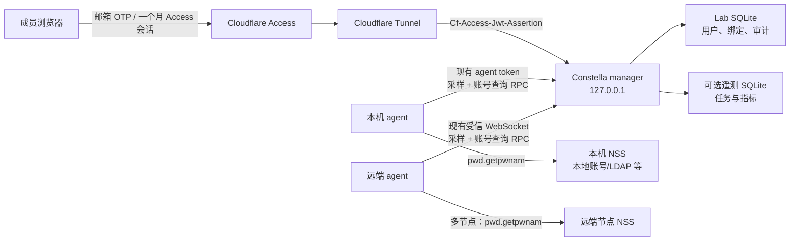

# Constella Lab 用户系统设计

> 状态：v1 设计方案
>
> 更新日期：2026-09-05
>
> 适用范围：当前部署一台 GPU 服务器，用户绑定协议从第一版支持多节点
>
> 当前不包含：GPU 预约、Slurm、异常占用处置、邮件通知、自动终止进程

## 1. 结论

Constella Lab 的第一版用户系统采用下面的组合：

- **Cloudflare Tunnel** 暴露公网域名，Constella manager 仍只监听 `127.0.0.1`。
- **Cloudflare Access + 邮箱一次性验证码（OTP）** 负责登录和入口准入，不自建密码、验证码或邮件服务。
- Access 的应用和策略会话时长均设置为 **一个月**。用户通常不需要重复收取验证码，但在会话过期、主动退出、清除 Cookie、更换浏览器或管理员撤销会话后需要重新验证。
- 管理员在 Cloudflare Access 中维护允许登录的**精确邮箱列表**。不能只用“登录方式为 OTP”作为允许条件，否则任何能收到 OTP 的邮箱都可能进入。
- 用户第一次通过 Access 登录时，Constella 根据已验证的 JWT 自动建立本地用户记录，不提供传统“注册页面”。
- 用户可以在网页中同时选择一个或多个节点，并为每个节点输入对应的 Linux 用户名。系统并行查询各节点，全部满足规则后批量绑定，无需管理员逐个登记、无需 sudo、无需给每个人安装 CLI。
- 账号存在性查询只说明“这个 Linux 账号存在”，**不能证明当前邮箱持有人拥有它**。第一版将这类绑定明确记录为 `self_claimed`，只用于个性化任务记录和统计。
- 管理员只负责准入、角色调整、冲突纠正和离组，不负责日常绑定。
- Lab 身份数据使用独立的小型 SQLite 数据库，不和可选的遥测历史数据库绑定，也不要求启用完整历史分析功能。
- Lab 作为同一 Git 仓库中的独立子包维护，依赖方向固定为 `constella_lab -> constella core`，核心不能反向依赖 Lab。
- 从第一版扩展现有 agent WebSocket，提供带能力声明的按用户名查询 RPC；本机与远端节点走统一接口，不在节点上另起 Web 服务。

这套方案有意接受一个适合小课题组的弱点：已获准进入系统的成员可能抢先认领另一个尚未绑定的 Linux 账号。它通过精确邮箱准入、唯一绑定约束、审计记录和管理员纠错降低影响，但不假装已经完成强所有权验证。任何未来的高风险能力都不能直接信任 `self_claimed` 绑定。

## 2. 目标和非目标

### 2.1 目标

1. 成员可以在校内外通过浏览器安全访问 Constella。
2. 不维护密码，不发送业务邮件，不运行自建邮件服务器。
3. 浏览器身份能稳定关联到 Linux UID，为“我的任务”和个人统计提供基础。
4. 正常入组和账号绑定尽量由系统与用户自助完成。
5. 管理员可以冻结用户、调整角色、撤销或纠正错误绑定。
6. 在没有 root 权限时即可部署，多节点账号校验复用现有 agent，不要求新增常驻节点服务。
7. 不破坏原版 Constella 的本地轻量用法；未启用 Lab 认证时维持现有行为。

### 2.2 当前非目标

- 不实现 GPU 预约或排队。
- 不接入 Slurm。
- 不发送异常占用提醒邮件。
- 不提供网页终止进程、自动 `kill` 或 sudo 执行器。
- 不接收、代理或存储校园统一身份认证密码。
- 不承诺 `self_claimed` 已证明 Linux 账号的真实所有权。
- 不公开枚举节点上的 `/etc/passwd` 或所有未绑定用户名。

## 3. 系统边界



### 3.1 各层职责

| 层 | 负责 | 不负责 |
| --- | --- | --- |
| Cloudflare Access | 验证邮箱、执行允许策略、维护一个月浏览器会话、入口封禁 | Lab 角色、Linux 账号绑定、任务归属 |
| Constella Lab | 校验 Access JWT、建立本地用户、授权、绑定、审计 | 密码、OTP 发送、邮箱投递 |
| Constella agent | GPU 采样；按请求在所在节点查询一个指定用户名 | 浏览器登录、用户数据库、账号列表上报 |
| 操作系统 NSS | 判断节点账号是否存在，返回规范用户名和 UID | 判断邮箱是否是该账号的真实所有者 |

### 3.2 两套认证必须分开

Constella 当前至少有三类连接：

1. 浏览器 HTTP API 和 `/ws/cluster`：使用 Cloudflare Access JWT。
2. `/api/agents/ws`：继续使用独立的 agent token。
3. `/api/highres/stream`：继续使用独立的 high-resolution stream token。

浏览器认证中间件必须排除后两类内部连接，但它们各自必须继续执行现有 token 校验。单机 agent 应连接 `ws://127.0.0.1:<port>/api/agents/ws`，不经过公网域名和 Access。

未来远端 agent 若必须经过 Cloudflare 网络，应使用单独的主机名或路径策略，并用 Cloudflare Service Auth 加现有 agent token 做机器认证；不能给它套用邮箱 OTP，也不能把 agent 路径设为无条件公网 bypass。

## 4. 身份、角色和状态

### 4.1 两类身份

系统不要把邮箱直接当数据库主键：

- **外部身份**：Cloudflare Access JWT 中的 `(iss, sub)`。
- **展示与联系字段**：JWT 中已验证的 `email`。
- **节点执行身份**：`(node_id, unix_uid)`；用户名只是可变的展示字段。

选择 `(iss, sub)` 是因为 `sub` 是 Access 为用户签发的稳定标识，邮箱可以变更。Cloudflare 文档同时说明，用户从 Zero Trust 组织删除后重新加入时 `sub` 可能变化，因此系统仍需保留人工身份迁移能力，不能仅凭同名邮箱自动继承历史权限。

### 4.2 角色

| 角色 | 权限 |
| --- | --- |
| `viewer` | 查看实时状态、任务与允许公开的统计；不能绑定节点账号 |
| `member` | `viewer` 的全部权限；可以创建、查看和结束自己的绑定 |
| `admin` | 管理用户状态与角色、纠正绑定、查看审计、修改全局运行设置 |

默认通过精确邮箱准入的新用户创建为 `member`。若以后需要临时访客，管理员可将其降为 `viewer`。

前端隐藏按钮不是授权措施。所有角色判断都必须在后端执行。现有 `PATCH /api/settings` 会影响所有 agent，只允许 `admin` 调用。

### 4.3 用户状态

- `active`：正常使用。
- `disabled`：即使仍持有有效 Access JWT，也由 Constella 返回 `403`。
- `pending_identity_review`：新的 `(iss, sub)` 与已有邮箱记录冲突，需要管理员判断是身份迁移还是新用户。

角色和状态互相独立。离组时应设置 `disabled`，而不是删除用户记录。

### 4.4 绑定可信等级

| 等级 | 含义 | 第一版用途 |
| --- | --- | --- |
| `self_claimed` | 用户输入的账号在节点存在，但没有完成所有权证明 | “我的任务”、个人统计、界面偏好 |
| `admin_verified` | 管理员通过线下事实确认归属 | 同上，为后续策略保留更高可信度 |
| `node_verified` | 用户在节点侧完成了强所有权挑战 | 第一版不实现 |

未来的终止进程、强制释放 GPU、代表用户提交任务等能力，至少要求 `node_verified`，并且还要有独立的最小权限执行与审批设计。不能因为用户已经登录网页，或绑定为 `self_claimed`，就允许高权限操作。

## 5. 用户生命周期

### 5.1 首位管理员初始化

1. 运维者在 Cloudflare 创建 Tunnel、Access Self-hosted application 和 OTP 登录方式。
2. Access Allow 策略只包含明确批准的邮箱或由这些邮箱组成的 Access group。
3. 配置 `CONSTELLA_BOOTSTRAP_ADMIN_EMAIL`。
4. 当 Lab 数据库中尚无管理员，且该邮箱通过有效 Access JWT 首次登录时，将该用户创建为 `admin`。
5. 首位管理员建立后，后续管理员由现有管理员在 Lab 中授予。建议随后从运行配置中移除 bootstrap 邮箱，避免配置长期承担授权职责。

Bootstrap 只能在“数据库中不存在管理员”时执行；不能在每次启动时重复提升同名邮箱。

### 5.2 新成员加入

| 步骤 | 执行者 | 操作 |
| --- | --- | --- |
| 1 | 管理员 | 将成员的精确邮箱加入 Access 允许列表 |
| 2 | 用户 | 访问域名，收取并输入 Cloudflare OTP |
| 3 | 系统 | 校验 JWT，JIT 创建本地 `member` 记录 |
| 4 | 用户 | 在“我的账号”中选择一个或多个节点，并逐节点输入 Linux 用户名 |
| 5 | 系统 | 并行查询所选节点；全部满足规则后批量创建 `self_claimed` 绑定 |

管理员不需要预先创建 Lab 用户，也不需要替用户绑定 Linux 账号。

### 5.3 日常登录

Access 的应用与策略会话时长设置为一个月。Constella 不再另外签发一枚“一个月登录 Cookie”，也不存储 OTP。浏览器每个请求都经 Access，origin 对收到的 JWT 再做本地校验。

用户通常只在以下情况重新收取验证码：

- 一个月会话到期；
- 主动退出；
- Cookie 被删除或浏览器/设备发生变化；
- 管理员撤销 Access 会话；
- Access 策略变化要求重新认证。

页面提供“退出登录”，链接到：

```text
https://<应用域名>/cdn-cgi/access/logout
```

### 5.4 成员离组

离组是两层撤销，建议按下面顺序完成：

1. 从 Access 允许列表移除邮箱，阻止新会话。
2. 在 Cloudflare Zero Trust 中撤销该用户现有 Access 会话。
3. 在 Constella Lab 中将用户设置为 `disabled`。
4. 结束其所有当前账号绑定，保留历史绑定和审计记录。
5. 如需停用 Linux 账号，由服务器账号管理员在操作系统侧单独处理；Constella 在无 root 权限下不承担这一步。

只做第 1 步可能不会立刻终止已经签发的会话；只做第 3 步又不会阻止用户继续触达 Access 入口，因此两层都要处理。

## 6. Linux 账号自助绑定

### 6.1 用户流程

1. 用户打开“我的账号”。
2. 页面以表格列出可绑定节点；用户可以同时勾选一个或多个节点。
3. 用户为每个选中节点输入对应的 Linux 用户名，不显示全量账号列表。页面可提供“将此用户名填入所有已选节点”，但每一行仍可单独修改。
4. 后端通过各节点的 agent 并行查询账号，并逐行返回规范用户名和 UID 供确认。
5. 只要有一个节点查询失败，整批暂不创建；用户可以修正该行，或取消选择该节点后重试。
6. 用户确认后，后端再次并行查询所有节点。全部通过后，在 manager 的一个 SQLite 事务中创建整批绑定。
7. 页面逐节点显示 `self_claimed`，并说明它只用于任务归属和统计。

查询与创建分为两次，是为了让用户确认规范化后的结果；真正写入前必须重新查询，不能信任之前的预览结果。agent 查询都是只读操作，因此可以先完成所有节点复查，再用一个本地数据库事务原子写入：要么整批成功，要么一条都不创建。

一个 Web 用户在每个节点最多绑定一个账号。不同节点可以使用相同用户名，也可以使用不同用户名；任务归属始终使用 `(node_id, unix_uid)`，不能假设同名账号跨节点拥有相同 UID。

### 6.2 为什么不列出“未绑定账号”

- 枚举 `/etc/passwd` 或 NSS 会暴露与当前用户无关的系统和成员信息。
- 多节点时需要不断同步账号列表，增加协议、缓存和一致性成本。
- 用户本来就应知道自己的 SSH 用户名，按需查询一个名字足够。
- 输入式查询天然适配本地账号、LDAP/NSS 和多个节点。

### 6.3 节点查询实现

从第一版起，账号查询由目标节点现有的 Constella agent 执行，包括与 manager 同机的 local agent。agent 使用：

```python
pwd.getpwnam(username)
```

它通过节点的系统 NSS 查询本地账号或已配置的目录服务，不需要 root。统一走 agent 的好处是 manager 不会错误地用自己的 `/etc/passwd` 判断远端节点，而且从单机增加到多节点时不需要更换绑定数据模型和 API。

实现要求：

- 不拼接 shell，不执行 `sh -c "id <username>"`。
- agent 在工作线程中执行 NSS 查询，并设置短超时，避免 LDAP/NSS 故障阻塞 agent 事件循环。
- 只使用系统返回的规范用户名、UID、GID 和 shell；数据库不保存未经确认的原始输入。
- 不要求 home 目录已经存在，因为网络 home 可能按需挂载。
- agent 必须运行在与 GPU 任务相同的用户命名空间和 NSS 环境中；若 agent 在容器中，必须确认它能看到宿主机账号，否则该节点不能声明账号查询能力。

### 6.4 可绑定账号规则

默认满足全部条件才可绑定：

- 用户名符合可配置格式；本地普通 Linux 账号可默认使用 `^[a-z_][a-z0-9_-]{0,31}$`。
- NSS 查询成功。
- UID 不为 `0`，且符合可配置的普通用户 UID 范围。
- 用户名不在拒绝列表中；拒绝列表至少包含 `root`、运行 Constella 的服务账号和已知系统/共享账号。
- shell 不是 `nologin`、`false` 等禁止交互登录的 shell。
- 该用户在同一节点没有另一个当前绑定。
- 该 `(node_id, unix_uid)` 尚未被另一用户绑定。

用户名格式、UID 范围和拒绝列表必须可配置。若实验室使用 LDAP、域账号或特殊命名规则，管理员可以调整，而不需要修改代码。

为了减少用户名枚举，账号不存在、被拒绝、已被认领等情况对普通用户统一返回“该账号当前无法绑定”。节点离线或 agent 版本不支持查询可以明确显示为系统状态。详细账号拒绝原因只写入受保护的审计记录。查询接口仅限已登录 `member`，并执行限流。

建议默认限流：

- 查询：每用户每分钟 10 个节点、每天 50 个节点；批量请求按节点数计数；
- 创建或更换绑定：每用户每天 5 次；
- 单机第一版用进程内限流即可，重启后清零可以接受。

### 6.5 用户更换与管理员纠错

为了不把正常纠错变成管理员日常工作：

- 用户可以主动结束自己的当前绑定，然后绑定另一个尚未被认领的有效账号。
- 用户可以只结束其中一个节点的绑定，不影响其他节点。
- 结束操作只设置 `valid_to` 和状态，不删除旧记录。
- 用户不能接管已绑定给别人的 `(node_id, unix_uid)`。
- 发生抢占、共享账号、UID 复用或成员无法自助解决的冲突时，由管理员纠正。
- 管理员“转移绑定”必须填写原因，并在同一数据库事务中结束旧绑定、建立新绑定和写入审计事件。

历史任务按任务发生时间匹配当时有效的绑定：

```text
binding.valid_from <= task_time < binding.valid_to
```

若 `valid_to` 为空，表示当前仍有效。这样 Linux 用户名或 UID 被以后重新分配时，不会把旧任务追溯转给新成员。

### 6.6 Agent 协议扩展

多节点不引入新的节点 Web 服务，也不要求每位用户安装命令。第一版直接复用现有 manager-agent WebSocket，增加能力声明和请求/响应消息。

agent 的 `hello` 消息增加能力列表：

```json
{
  "type": "hello",
  "node_id": "gpu-server-01",
  "capabilities": ["account_lookup_v1"]
}
```

manager 只有看到 `account_lookup_v1` 后，才允许该节点出现在可绑定列表中。旧 agent 不声明此能力时仍可继续采样，只是暂时不能完成账号绑定，保持协议向后兼容。

单个查询请求：

```json
{
  "type": "account_lookup_request",
  "request_id": "01J...",
  "node_id": "gpu-server-01",
  "username": "alice"
}
```

agent 在自己的节点执行 `pwd.getpwnam`，返回最小结果：

```json
{
  "type": "account_lookup_response",
  "request_id": "01J...",
  "node_id": "gpu-server-01",
  "exists": true,
  "canonical_username": "alice",
  "uid": 1008,
  "gid": 1008,
  "shell": "/bin/bash"
}
```

要求：

- manager 只允许向已经通过 agent token 认证、且 `node_id` 匹配的连接发请求。
- manager 为每个节点维护有限数量的 pending request，并用 `(node_id, request_id)` 关联响应；断线时立即失败该节点的待处理请求。
- agent 同样执行输入校验，不接受账号列表查询。
- agent 使用小型并发信号量限制 NSS 查询数；RPC 有请求 ID、短超时和最大并发数。
- manager 对一批节点并行请求，而不是串行等待；整批设置总超时，避免一个故障节点拖住所有请求。
- 节点离线、能力不支持或查询超时时返回逐节点错误，不能凭缓存创建绑定。
- manager 在写入前重新发起查询，并应用统一的账号资格策略。
- agent 不上报密码哈希、authorized keys、组列表、home 内容或 `/etc/passwd` 全量数据。

### 6.7 批量一致性

跨节点 NSS 查询无法形成分布式事务，也没有必要引入两阶段提交，因为查询不修改节点状态。第一版采用以下边界：

1. 并行执行所有最终 NSS 查询。
2. 任一查询失败则不写数据库。
3. 全部成功后开启单个 SQLite transaction。
4. 在事务内检查当前绑定唯一约束、插入全部绑定并写入审计。
5. 任一唯一约束冲突则整个事务回滚。

因此系统保证 Lab 数据库不会出现一批请求“只成功一半”。它不保证查询结束后操作系统账号永远不变化；后续任务关联仍以采样时观察到的 UID 和绑定有效期为准。

## 7. 数据模型

Lab 数据建议存放在独立文件，例如：

```text
run/lab/identity.sqlite3
```

该数据库是启用 Lab 模式的必要状态，但与 `CONSTELLA_DB_PATH` 指向的可选遥测库分开。这样关闭历史采集时用户系统仍然可用，身份备份、迁移和访问权限也能独立管理。

### 7.1 `lab_users`

| 字段 | 类型 | 说明 |
| --- | --- | --- |
| `id` | TEXT PK | 应用内部随机 ID，不用邮箱作主键 |
| `access_issuer` | TEXT | JWT `iss` |
| `access_subject` | TEXT | JWT `sub` |
| `email` | TEXT | 最近一次已验证邮箱原文 |
| `email_normalized` | TEXT | 去空格、小写后的查询字段 |
| `display_name` | TEXT NULL | 用户或管理员维护的显示名 |
| `role` | TEXT | `viewer/member/admin` |
| `status` | TEXT | `active/disabled/pending_identity_review` |
| `created_at` | REAL | 创建时间 |
| `updated_at` | REAL | 更新时间 |
| `last_login_at` | REAL | 最近登录时间；限制写入频率 |

约束：

```sql
UNIQUE(access_issuer, access_subject)
```

`email_normalized` 建索引但不直接设为全局唯一。发现同邮箱、不同 `sub` 时进入 `pending_identity_review`，由管理员确认是否迁移，防止邮箱被重新分配后自动继承旧权限。

身份冲突按下面方式处理：

- 确认是同一个人被 Access 重新创建：管理员将旧用户的 `(access_issuer, access_subject)` 更新为新值，保留原 `user_id`、角色和绑定，并把旧值写入审计事件。
- 确认是邮箱后来分配给了另一个人：旧用户保持 `disabled`，新用户使用新的 `user_id`，不继承旧绑定和任务归属。

该操作必须是独立的管理员动作，不能由普通 `PATCH /api/lab/me` 完成。

### 7.2 `lab_account_bindings`

| 字段 | 类型 | 说明 |
| --- | --- | --- |
| `id` | TEXT PK | 绑定 ID |
| `user_id` | TEXT FK | 对应 `lab_users.id` |
| `node_id` | TEXT | Constella 节点 ID |
| `unix_uid` | INTEGER | 任务归属的主要键 |
| `unix_gid` | INTEGER NULL | 查询时的主组，仅用于诊断 |
| `unix_username` | TEXT | 查询时的规范用户名快照 |
| `assurance` | TEXT | `self_claimed/admin_verified/node_verified` |
| `status` | TEXT | `active/revoked/reassigned` |
| `valid_from` | REAL | 生效时间 |
| `valid_to` | REAL NULL | 结束时间 |
| `created_by` | TEXT FK | 发起绑定的 Lab 用户 |
| `ended_by` | TEXT FK NULL | 结束绑定的 Lab 用户 |
| `reason` | TEXT NULL | 管理员纠错原因 |

SQLite 部分唯一索引保证每个节点当前是一对一关系：

```sql
CREATE UNIQUE INDEX uq_lab_binding_user_node_active
ON lab_account_bindings(user_id, node_id)
WHERE valid_to IS NULL;

CREATE UNIQUE INDEX uq_lab_binding_node_uid_active
ON lab_account_bindings(node_id, unix_uid)
WHERE valid_to IS NULL;
```

最终的 NSS 复查、唯一约束写入和审计事件必须处于同一事务，避免两名用户同时认领同一账号。

### 7.3 `lab_audit_events`

| 字段 | 类型 | 说明 |
| --- | --- | --- |
| `id` | INTEGER PK | 单调递增 ID |
| `occurred_at` | REAL | 事件时间 |
| `actor_user_id` | TEXT NULL | 操作者；系统事件可为空 |
| `action` | TEXT | 如 `binding.created`、`user.disabled` |
| `target_type` | TEXT | `user`、`binding`、`identity` 等 |
| `target_id` | TEXT NULL | 目标 ID |
| `request_id` | TEXT | 关联一次请求 |
| `details_json` | TEXT | 最小化、结构化的变更说明 |

应用层不提供修改和删除审计事件的 API。审计内容不得保存 OTP、JWT、Access Cookie、agent token、完整请求头或其他秘密。默认保留 180 天可满足小型实验室排错；涉及绑定和角色变更的关键事件也可以长期保留。

### 7.4 数据库运行要求

- SQLite 开启 `foreign_keys=ON` 和 WAL。
- 数据库目录权限设为 `0700`，文件设为 `0600`。
- 只由一个 manager 进程写入；当前单机不引入数据库服务。
- 使用 schema migration 表管理版本，禁止依靠“删库重建”升级。
- 备份使用 SQLite backup API 或一致性快照，不在 WAL 写入期间只复制主文件。
- 备份与数据库使用相同或更严格的文件权限。

## 8. API 设计

现有 `/api/users` 表示遥测聚合用户，不复用这个名字。Lab 用户接口统一放在 `/api/lab` 下。

### 8.1 当前用户

| 方法 | 路径 | 角色 | 用途 |
| --- | --- | --- | --- |
| `GET` | `/api/lab/me` | 已登录 | 当前用户、角色、状态、绑定列表 |
| `PATCH` | `/api/lab/me` | `member+` | 修改显示名等非安全字段 |
| `GET` | `/api/lab/account-binding-nodes` | `member+` | 返回在线且声明账号查询能力的节点 |
| `POST` | `/api/lab/account-lookups/batch` | `member+` | 并行预览多个节点的账号查询结果 |
| `POST` | `/api/lab/account-bindings/batch` | `member+` | 复查全部节点后原子创建自己的整批绑定 |
| `DELETE` | `/api/lab/account-bindings/{id}` | 所有者 | 结束自己的当前绑定；不是物理删除 |

批量账号查询请求：

```json
{
  "accounts": [
    {"node_id": "gpu-server-01", "username": "alice"},
    {"node_id": "gpu-server-02", "username": "alice-lab"}
  ]
}
```

响应按节点返回必要字段；一行失败不会阻止用户查看其他行的预览结果：

```json
{
  "results": [
    {
      "node_id": "gpu-server-01",
      "bindable": true,
      "canonical_username": "alice",
      "uid": 1008
    },
    {
      "node_id": "gpu-server-02",
      "bindable": false,
      "error": "account_not_bindable"
    }
  ]
}
```

最终创建接口使用相同的 `accounts` 请求结构，不得接受客户端提交的 UID 作为事实来源。服务端重新并行查询所有节点；只要有一项失败就不写入，全部通过后才在一个 SQLite 事务中保存整批结果。

### 8.2 管理员

| 方法 | 路径 | 用途 |
| --- | --- | --- |
| `GET` | `/api/lab/admin/users` | 搜索用户、角色、状态与当前绑定 |
| `PATCH` | `/api/lab/admin/users/{id}` | 调整角色、状态、显示名 |
| `POST` | `/api/lab/admin/users/{id}/migrate-identity` | 审核同邮箱的新 Access 身份并显式迁移 |
| `POST` | `/api/lab/admin/bindings/reassign` | 原子纠正或转移绑定，必须提供原因 |
| `POST` | `/api/lab/admin/bindings/{id}/verify` | 标记为 `admin_verified` |
| `GET` | `/api/lab/admin/audit-events` | 分页查看审计事件 |

不能通过 Lab 管理界面直接“添加一个能登录的邮箱”，除非未来专门接入最小权限的 Cloudflare API。第一版管理员仍在 Cloudflare 控制台维护入口名单，避免 Constella 保存 Cloudflare 管理令牌。

### 8.3 现有接口授权

| 接口类别 | 处理 |
| --- | --- |
| `/api/health` | 可保持最小信息的未登录健康检查，不返回用户名和配置秘密 |
| 现有浏览器只读 API | 要求有效 Access 身份和本地 `active` 用户 |
| `PATCH /api/settings` | 仅 `admin` |
| `/ws/cluster` | 握手时校验 Access JWT 和本地用户状态 |
| `/api/agents/ws` | 不走用户 JWT，继续严格校验 agent token |
| `/api/highres/stream` | 不走用户 JWT，继续严格校验 stream token |
| `/api/docs` | Lab 模式下要求 `admin`，或生产环境关闭 |

### 8.4 错误约定

- `401`：缺少、过期或无效 Access JWT。
- `403`：本地用户被禁用、待审核或角色不足。
- `409`：最终写入时绑定发生并发冲突；普通用户不获得另一成员信息。
- `422`：请求格式不合法，或统一的 `account_not_bindable`。
- `503`：节点离线、NSS 超时或账号验证暂不可用。

所有响应包含 `request_id`，便于管理员将用户看到的通用错误与审计记录关联。

## 9. Cloudflare Access 配置

### 9.1 必需配置

1. Tunnel 将公网主机名映射到 `http://127.0.0.1:<manager-port>`。
2. 创建覆盖该主机名的 Access Self-hosted application。
3. 启用 One-time PIN 身份提供方式。
4. 创建 Allow 策略，`Include` 使用**精确邮箱**或实验室成员 Access group。
5. 应用 session duration 设置为一个月；该 Allow policy 的 session duration 也设置为一个月或继承应用值。若希望多个 Access 应用间的 SSO 也保持一个月，再将 global session duration 同样设置为一个月。
6. 用 Access policy tester 检查一个允许邮箱和一个未允许邮箱。
7. 确认 WebSocket 已启用，并测试 `/ws/cluster` 能持续连接。

禁止使用下面的策略作为唯一允许条件：

```text
Include -> Login Methods -> One-time PIN
```

Cloudflare 官方文档将它列为常见错误，因为这表示允许所有能够使用 OTP 的有效邮箱，而不是只允许实验室成员。

### 9.2 Origin JWT 校验

Cloudflare 在 origin 请求中加入：

```text
Cf-Access-Jwt-Assertion: <JWT>
```

Constella 必须校验该 header，不能只相信 header 存在，也不能信任客户端自填的 `X-Forwarded-Email`。校验项目：

- 算法固定为允许的非对称签名算法，拒绝 `none` 和算法降级。
- 使用 `https://<team>.cloudflareaccess.com/cdn-cgi/access/certs` 的 JWKS 验证签名。
- `iss` 精确等于配置的 team domain。
- `aud` 包含配置的 Access application AUD tag。
- `exp`、`nbf`、`iat` 在允许的小时钟偏差内。
- token 类型适用于 Access application 用户身份。
- `sub` 与已验证 `email` 均存在。

JWKS 在内存中按 HTTP 缓存语义缓存；遇到未知 `kid` 时刷新一次。网络失败且没有可用缓存时应 fail closed，不能退化为信任未验证 JWT。不要自行实现 RSA 密码学；实现阶段应选择维护活跃、支持 JWKS 的最小 JWT 库，并将其限制为 Lab 可选依赖。

### 9.3 HTTP、SPA 和 WebSocket 会话

- 前端 AJAX 请求增加 `X-Requested-With: XMLHttpRequest`，并在 Access 返回 `401` 时刷新页面进入重新登录流程。
- 修改状态的 `POST/PATCH/DELETE` 还需检查同源 `Origin`，并要求自定义请求 header；CORS 不允许任意来源，以降低 CSRF 风险。
- `/ws/cluster` 在 HTTP upgrade 阶段校验 JWT。连接建立后每分钟检查本地用户是否仍为 `active`。
- 为避免一个已撤销的长连接无限存活，可将浏览器 WebSocket 最大连接寿命限制为 15 分钟，由前端自动重连；重连会重新经过 Access 边缘检查。JWT 到期时必须更早关闭。
- 管理员禁用用户后，应主动关闭该用户当前已知的 WebSocket；周期检查和 15 分钟重连是兜底。

### 9.4 认证模式与向后兼容

建议配置：

```text
CONSTELLA_AUTH_MODE=cloudflare-access
CONSTELLA_ACCESS_TEAM_DOMAIN=https://<team>.cloudflareaccess.com
CONSTELLA_ACCESS_AUD=<application-audience-tag>
CONSTELLA_LAB_DB_PATH=run/lab/identity.sqlite3
CONSTELLA_BOOTSTRAP_ADMIN_EMAIL=<admin@example.com>
CONSTELLA_ACCOUNT_UID_MIN=1000
CONSTELLA_ACCOUNT_DENY_USERS=root,constella,...
```

`CONSTELLA_AUTH_MODE`：

- `disabled`：保持原版 Constella 行为，默认只允许绑定 loopback 或通过 SSH 隧道访问。
- `cloudflare-access`：启用 Lab 用户系统；缺少 team domain、AUD 或 Lab DB 路径时拒绝启动，不能静默降级。

不要提供能在生产中通过伪造邮箱 header 登录的 `development` 模式。测试通过依赖注入构造已验证身份；本地预览可显式使用 `disabled`，并只监听隔离的 loopback 端口。

## 10. 前端页面

### 10.1 用户菜单

右上角用户菜单显示：

- 显示名与邮箱；
- `viewer/member/admin` 角色；
- “我的账号”；
- 管理入口（仅 admin）；
- “退出登录”。

### 10.2 我的账号

绑定表单使用多节点表格：

| 选择 | 节点 | 状态 | Linux 用户名 | 查询结果 |
| --- | --- | --- | --- | --- |
| ✓ | gpu-server-01 | 在线 | alice | alice · UID 1008 |
| ✓ | gpu-server-02 | 在线 | alice-lab | 等待查询 |
|  | gpu-server-03 | 离线 | — | 当前不可绑定 |

支持勾选多个节点、“填入所有已选节点”以及逐行修改，但不默认替用户选中全部节点。查询和最终确认期间按钮显示整体进度，每一行独立显示成功、失败、离线或版本不支持状态。

已有绑定采用紧凑表格而不是卡片堆叠：

| 节点 | Linux 用户 | UID | 可信等级 | 状态 | 操作 |
| --- | --- | --- | --- | --- | --- |
| gpu-server-01 | alice | 1008 | 自助认领 | 当前 | 结束绑定 |

空状态直接引导选择节点并输入用户名。批量绑定确认框列出所有即将创建的 `(节点, 规范用户名, UID)`，并明确写出：

> 系统已确认该账号存在，但尚未证明你拥有该账号。当前绑定仅用于任务归属和个人统计。

错误不暴露其他成员姓名或账号归属；显示 `request_id` 供管理员排查。

### 10.3 管理页面

管理员页面提供三个连续数据区：

1. 用户：邮箱、显示名、角色、状态、最近登录。
2. 当前绑定：节点、用户名、UID、可信等级、生效时间。
3. 审计：时间、操作者、动作、目标和原因。

高风险操作使用二次确认：禁用用户、授予 admin、转移绑定。转移绑定必须填写原因。界面不提供物理删除用户和历史绑定的按钮。

### 10.4 任务个性化

绑定完成后可以增加“我的任务”过滤器。任务关联优先使用采样节点返回的 UID；当前 `GpuProcess` 只有用户名时，可暂时使用 `(node_id, username, task_time)` 匹配，但应在采集模型中补充 numeric UID，避免用户名更改或复用造成歧义。

第一版不要因为无法完成任务关联而阻止监控数据展示。关联失败的任务保持“未关联”，不猜测所有者。

## 11. 安全与隐私

### 11.1 威胁模型

第一版主要防御：

- 未获准的公网访问者；
- 伪造 Cloudflare 身份 header；
- 已登录普通成员调用管理员 API；
- Linux 用户名枚举和并发抢占；
- Access 会话被管理员撤销后继续保持长连接；
- 数据库、日志或备份泄露 JWT、OTP 和 token。

第一版不完全防御：

- 获准成员恶意认领一个尚未绑定的他人账号；
- 成员浏览器或邮箱本身已被攻陷；
- 服务器 root 或 Constella 运行用户被攻陷；
- Cloudflare 服务不可用或特定网络到 Cloudflare 的可用性问题。

### 11.2 基本措施

- origin 仅监听 `127.0.0.1`，不开放额外入站端口。
- JWT 验证签名、issuer、audience 和有效期，失败时关闭访问。
- Access 精确邮箱准入与 Lab 本地状态形成两层授权。
- admin 权限只在服务端判断；变更写审计。
- 所有 SQL 使用参数绑定；所有用户名查询不经过 shell。
- 设置严格同源 CORS、CSRF 防护、CSP、`frame-ancestors` 和常见安全响应头。
- 日志对 JWT、Cookie、OTP、Cloudflare service token 和 agent token 做整体排除或脱敏。
- 前端不在 Local Storage 保存认证 token；Access Cookie 由 Cloudflare 管理。
- 用户接口只暴露完成产品功能所需的邮箱、节点、用户名和 UID。

### 11.3 共享可见性

Constella 当前监控页本来就会展示进程用户名。上线前管理员应明确告知成员：实验室成员可以看到节点上的 GPU 进程、用户名和资源占用。若以后需要更严格隐私，应另行设计数据裁剪策略，而不是仅隐藏前端列。

## 12. 管理员实际工作量

### 初次部署一次性工作

- 配置域名、Tunnel、Access application、OTP 和一个月会话。
- 建立精确邮箱 Allow policy。
- 配置 bootstrap admin、Lab DB 路径、UID 规则和系统账号拒绝列表。
- 检查 origin 只监听 loopback，备份目录权限正确。

### 新成员加入

- 只需将邮箱加入 Access 允许列表。
- 用户与绑定由首次登录和自助输入自动完成。

### 日常维护

- 处理少量“账号已被认领”或错误绑定冲突。
- 必要时调整用户角色或禁用状态。
- 检查备份是否成功；按需查看审计。

### 成员离组

- Access 移除邮箱并撤销会话。
- Lab 禁用用户并结束绑定。
- Linux 账号是否停用交给服务器账号管理员。

因此管理员不维护第二套密码，不注册 Linux 账号清单，也不逐人绑定。

## 13. 代码与发布边界

确定采用 **同一 Git 仓库中的独立子包**，不使用 Git submodule，也不维护长期 `constella-lab-version` 分叉。建议目录边界：

```text
packages/
  backend/                   # Constella 核心 manager 与 agent
  web/                       # 核心 Web 发行包
  tui/
  lab/                       # 独立 constella_lab Python 包
    pyproject.toml
    src/constella_lab/
      app.py
      auth/
      users/
      bindings/
      admin/
      audit/
      store.py
frontend/src/lab/            # Lab 页面与用户组件
tests/lab/
```

依赖方向固定为：

```text
constella_lab  ---->  constella core
constella core --X->  constella_lab
```

用户系统是 **Constella Lab 可选层**，不是 GPU 采样内核的前置条件：

- 核心 `schema`、collector、agent 采样和现有遥测数据库保持可独立工作。
- Lab 路由、Cloudflare 身份验证、角色、绑定、审计和 Lab SQLite 全部放入 `packages/lab`。
- 使用独立 Lab SQLite，不把用户表塞进遥测 sink 的启停逻辑。
- `AUTH_MODE=disabled` 保留原版轻量、本地优先行为。
- `constella_lab` 提供组合应用入口，在同一个 manager 进程中安装认证中间件、Lab router 和 Lab frontend，不另起一套服务。
- Lab 前端代码放在 `frontend/src/lab/`，通过 Lab 构建入口加载；不复制现有 Overview、Nodes、Jobs 页面。
- 多节点账号查询、numeric UID 和通用应用扩展点属于核心能力，在核心包中实现；它们不包含邮箱、角色或绑定语义。
- agent 只增加可选的 `account_lookup_v1` 能力，不复制或分叉 agent。旧 manager/agent 的采样协议继续兼容。

同一仓库不等于同一发行物。核心仍可发布为 `constella-gpu`，Lab 可单独发布为依赖兼容核心版本的 `constella-gpu-lab`。若以后 Lab 的扩展 API 和发布节奏已经稳定，再考虑把独立子包迁出仓库；届时使用正常的版本化包依赖，而不是 Git submodule。

## 14. 实施阶段

### 阶段 A：认证与用户基础

1. 增加 Lab 配置和独立 SQLite migration。
2. 实现 Access JWT verifier、JWKS 缓存和 FastAPI 身份依赖。
3. 实现 JIT 用户、bootstrap admin、`GET /api/lab/me`。
4. 保护现有浏览器 API、`/ws/cluster` 和 `PATCH /api/settings`。
5. 保持 agent/highres token 通道独立。
6. 增加用户菜单、退出和会话失效处理。

### 阶段 B：多节点账号绑定

1. agent `hello` 增加 `account_lookup_v1` 能力声明，保持旧协议兼容。
2. 实现带请求关联、并发限制和超时的 agent NSS 查询 RPC。
3. manager 实现按节点并行查询、断线清理和批量总超时。
4. 建立账号资格策略、按节点计数的限流和通用错误。
5. 实现批量预览、全量复查、原子创建、单节点结束绑定及事务唯一约束。
6. 实现多节点“我的账号”页面。
7. 任务采集模型增加 numeric UID，并按节点和历史有效期关联任务。

### 阶段 C：管理与运维

1. 实现用户、角色、状态、纠错和审计管理界面。
2. 补充离组操作清单、SQLite 一致性备份和恢复演练。
3. 在校内网、校外宽带和移动网络验证 Access 可用性。
4. 完成安全 header、CSRF、日志脱敏和限流验证。

### 阶段 D：远端 agent 公网接入（需要时）

1. 若新增服务器无法通过内网连接 manager，为机器连接配置独立的 Cloudflare Service Auth。
2. 验证 service token 与现有 agent token 的双层认证以及轮换流程。
3. 继续禁止把 agent 路径配置为无条件公网 bypass。

预约、Slurm、异常占用处置和 `node_verified` 强验证在用户系统稳定后分别设计，不与阶段 A 强行捆绑。

## 15. 验收标准

### 认证

- 非允许邮箱不能通过 Access；允许邮箱可用 OTP 登录。
- 一个月内同一有效浏览器会话不重复要求 OTP。
- 缺失 JWT、错误签名、错误 `iss`、错误 `aud`、过期 token 均被 origin 拒绝。
- Cloudflare signing key 轮换后 JWKS 能刷新，刷新失败时不会跳过校验。
- 被 Lab 禁用的用户即使仍有有效 JWT 也不能调用 API 或重连 WebSocket。

### 授权

- `viewer` 不能绑定账号或修改设置。
- `member` 不能调用任何 admin API。
- 只有 `admin` 能授予 admin、禁用用户和纠正他人绑定。
- 前端按钮隐藏与后端权限测试结果一致。

### 绑定

- 有效普通账号可自助绑定，无需 sudo。
- 用户可以在一次操作中为多个节点填写相同或不同的用户名。
- manager 并行查询节点；一个节点离线或超时时不会造成无限等待。
- 批量最终复查中任一节点失败时不创建任何绑定；数据库唯一约束冲突也整批回滚。
- 不存在账号、root、系统账号、nologin 账号和已认领 UID 不能绑定。
- 两个并发请求只能有一个成功认领同一 `(node_id, uid)`。
- 用户可以结束并更换自己的绑定，历史记录仍可按时间正确关联。
- NSS 超时不阻塞 agent 事件循环，也不会用旧缓存创建绑定。
- 不支持 `account_lookup_v1` 的旧 agent 仍能正常采样，并在绑定页面明确显示能力不可用。
- API 与日志不泄露账号列表、绑定所有者、JWT 或 token。

### 兼容性与运行

- `AUTH_MODE=disabled` 时原版本地功能和现有 API 行为保持兼容。
- 本机 agent 使用现有 token 连接，不依赖 Access 邮箱登录。
- 新旧 agent 与 manager 混合部署期间，GPU 监控协议保持兼容。
- Lab DB 未启用时，不影响核心采样和可选遥测 DB。
- 生产仍只监听 loopback；公网仅通过 Tunnel 到达。
- 用户与管理页面在桌面明暗主题和窄屏下均可用。
- 数据库备份可以实际恢复用户、当前绑定和审计数据。

## 16. 后续升级触发条件

出现以下任一情况时，应升级账号所有权验证，而不是继续扩大 `self_claimed` 权限：

- 网页允许终止进程或发送信号；
- 系统会自动惩罚异常占用；
- 预约结果会自动阻止其他用户运行；
- 网页代表用户提交 Slurm 或其他计算任务；
- 成员范围扩大到互不熟悉、难以线下纠错的人群；
- Linux 账号经常复用、共享或由外部目录动态分配。

届时可评估 `node_verified`：由用户在 SSH 会话内完成短期挑战、使用受控 PAM/SSO 映射，或由管理员导入权威账号目录。无论选择哪种方式，都应保留本设计中的 `(issuer, subject)`、`(node_id, uid)`、可信等级和时间有效期模型。

## 17. 参考资料

- [Cloudflare Access：One-time PIN login](https://developers.cloudflare.com/cloudflare-one/integrations/identity-providers/one-time-pin/)
- [Cloudflare Access：Access policies 与常见错误配置](https://developers.cloudflare.com/cloudflare-one/access-controls/policies/)
- [Cloudflare Access：Session management](https://developers.cloudflare.com/cloudflare-one/access-controls/access-settings/session-management/)
- [Cloudflare Access：Validate JWTs](https://developers.cloudflare.com/cloudflare-one/access-controls/applications/http-apps/authorization-cookie/validating-json/)
- [Cloudflare Access：Application token claims](https://developers.cloudflare.com/cloudflare-one/access-controls/applications/http-apps/authorization-cookie/application-token/)
- [Cloudflare Tunnel：Set up Cloudflare Tunnel](https://developers.cloudflare.com/tunnel/setup/)
- [Cloudflare：WebSockets](https://developers.cloudflare.com/network/websockets/)
